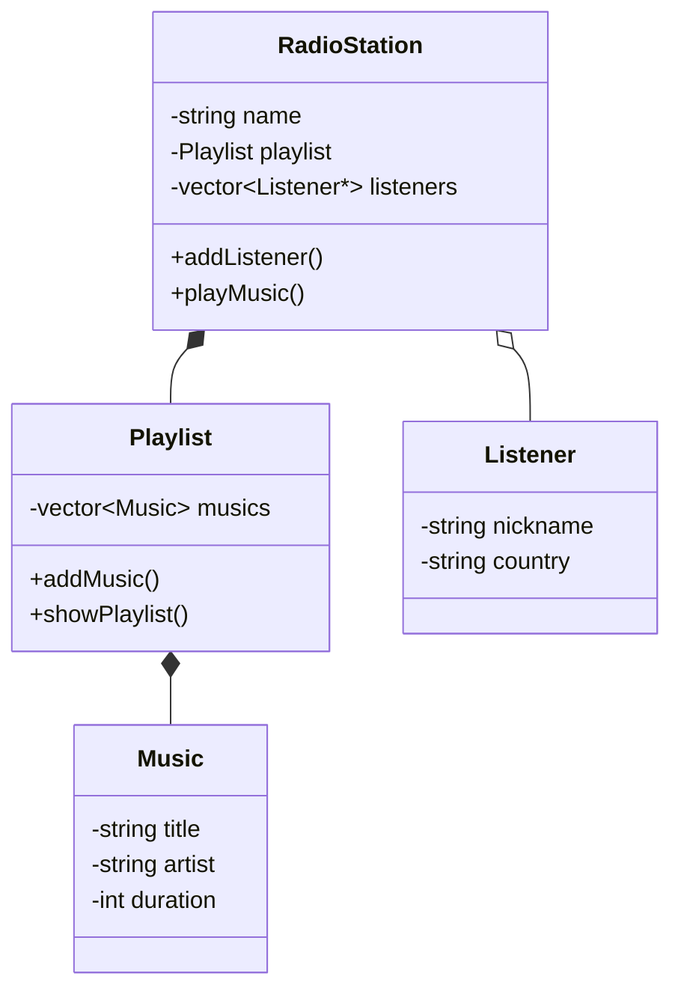

# PixelWave FM

A simple retro online radio system inspired by the radio stations created in the pirated versions of Habbo Hotels from 2016-2017. I'm just a nostalgic being.

## Technologies
- C++17
- CMake
- Object-Oriented Programming

## Features
- Music playlist system
- Listener management
- Online radio simulation
- Automatic DJ system

## Author
Vinicius Medeiros

# UML Diagram

